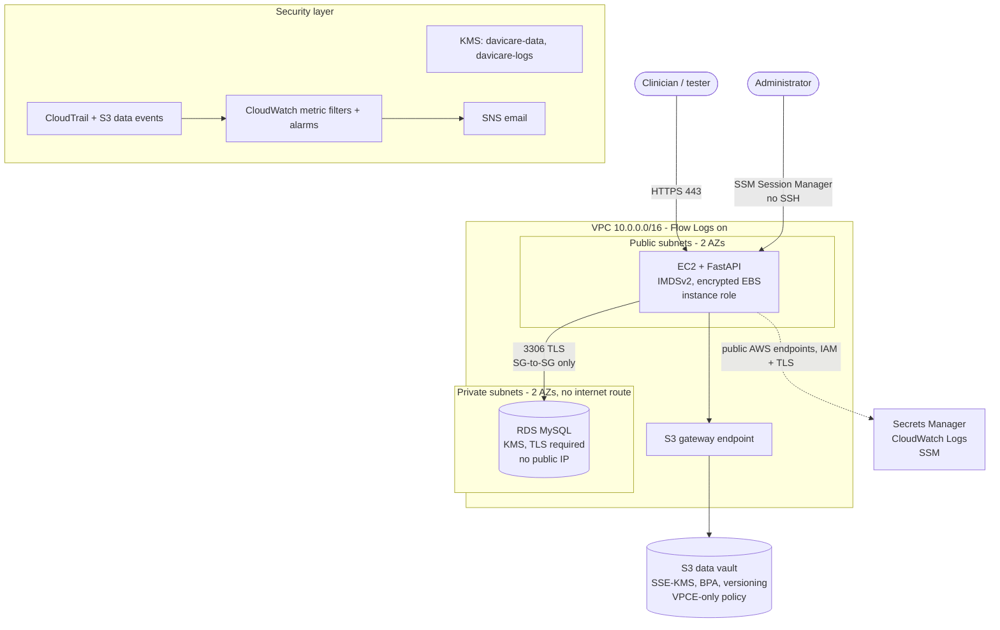

# Architecture

## Overview

The environment runs in one AWS region, in a single VPC (`10.0.0.0/16`) spread across two Availability Zones. It has two tiers:

| Tier | Subnets | Contents | Internet route |
|---|---|---|---|
| Public | `10.0.1.0/24`, `10.0.2.0/24` | EC2 app server | Yes, via Internet Gateway |
| Private | `10.0.11.0/24`, `10.0.12.0/24` | RDS MySQL (subnet group spans both) | **No** |

There is no NAT Gateway. The only path from the VPC to S3 is a free **S3 gateway endpoint**, attached to both route tables.



## Components

| Component | Purpose | Key security settings |
|---|---|---|
| EC2 app server | Runs the thin FastAPI app | Inbound 443 only; no key pair; SSM for admin; IMDSv2 required (hop limit 1); EBS encrypted with `davicare-data`; instance role with scoped permissions |
| RDS MySQL | Stores synthetic patient records | Private subnets; SG allows 3306 only from EC2 SG; `require_secure_transport=ON`; encrypted with `davicare-data`; RDS-managed master secret; deletion protection; encrypted backups |
| S3 data vault | Stores synthetic documents | Block Public Access; ACLs disabled; SSE-KMS with `davicare-data` required; TLS-only; VPC-endpoint-only access; versioning; access logs to separate bucket |
| KMS | Encryption keys | Two CMKs with rotation; key policies scoped to named roles and services |
| Secrets Manager | DB credentials | Master secret managed by RDS; separate app DB user secret; instance role can read only the app secret |
| CloudTrail | API audit trail | Multi-region; log file validation; KMS-encrypted dedicated bucket; CloudWatch Logs integration; S3 data events for the vault |
| CloudWatch + SNS | Detection and alerting | Metric filters and alarms for high-risk events; email via SNS |
| VPC Flow Logs | Network audit | All traffic to CloudWatch Logs, encrypted with `davicare-logs` |

## Data flows

### 1. Create or read a patient record

1. The client calls `POST /records` or `GET /records/{id}` over HTTPS (443).
2. FastAPI fetches the **app DB user** credentials from Secrets Manager using the instance role (cached briefly in memory, never written to disk).
3. FastAPI connects to RDS on 3306 with TLS and verifies the server certificate against the RDS CA bundle.
4. The query runs with bound parameters, never string concatenation.
5. FastAPI writes an audit event (`actor`, `action`, `record_id`, `timestamp`, `result`) to its CloudWatch log group. It never logs names, dates of birth or clinical fields.

### 2. Upload or download a document

1. The client uploads to `POST /records/{record_id}/documents` (or downloads with `GET`) over HTTPS.
2. FastAPI checks that the record exists and writes an audit event.
3. FastAPI puts or gets the object at `records/{record_id}/{document_id}` using its instance role, with SSE-KMS and `davicare-data`. The traffic goes through the S3 gateway endpoint.
4. The bucket policy rejects any request that isn't over TLS, doesn't come through the endpoint, or doesn't use the right KMS key.
5. CloudTrail S3 data events record the object-level access.

> **Design note.** The first plan used pre-signed URLs handed to the client. The bucket's VPC-endpoint-only condition still applies when a pre-signed URL is used, so a client on the internet would be denied. The app therefore proxies document transfers, and the client never talks to S3 directly. See [ADR-0010](adr/0010-app-proxies-s3-documents.md).

### 3. Administrative access

1. The administrator assumes the **break-glass admin role**, which requires MFA.
2. They start an SSM Session Manager session to the instance. Port 22 is closed and there are no SSH keys.
3. Session activity is recorded by CloudTrail. SSM session logging to CloudWatch is optional.

### 4. Logging pipeline

```
API calls ──► CloudTrail ──► S3 (KMS, validated) + CloudWatch Logs ──► metric filters ──► alarms ──► SNS email
VPC traffic ──► Flow Logs ──► CloudWatch Logs (KMS)
App events ──► CloudWatch Logs (KMS, PHI-free JSON)
S3 vault access ──► server access logs bucket + CloudTrail data events
```

## Identities

| Principal | Used by | Scope |
|---|---|---|
| `davicare-app-instance` role | EC2 app | Vault `records/*` get/put; `davicare-data` decrypt/generate via S3 and RDS only; one secret; own log group; SSM core. Capped by a permissions boundary. |
| `davicare-auditor` role | Reviewers | Read-only (SecurityAudit + ViewOnly style), no data read on the vault |
| `davicare-breakglass-admin` role | Administrator | Admin, MFA required, every use alarmed |
| `davicare-ci` role | GitHub Actions via OIDC | Plan/apply for this repo and branch only |
| `davicare-ai-invoker` role (disabled) | Future AI feature | `bedrock:InvokeModel` on approved model ARNs only |

## Future AI integration

The design keeps room for Amazon Bedrock behind a VPC interface endpoint, with a dedicated invoker role, Guardrails and invocation logging. It's disabled by default. See §5 of the [project plan](project-plan.md); `docs/ai-security.md` is written in Phase 7.
